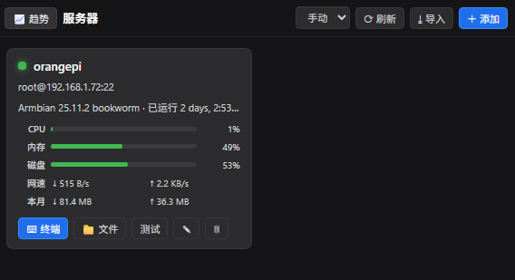
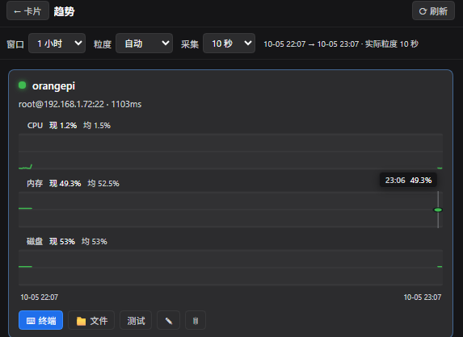

# DSH Server Box 🖧

**DeepSeek Harness 的服务器卡片仪表盘** —— 已连接服务器的卡片视图(在线状态 / CPU / 内存 / 磁盘 / 延迟),点卡片进入 xterm.js 交互终端;独立趋势视图记录并可视化一段时间的 CPU / 内存 / 磁盘变化。

[](https://awesome-dsh-plugin.com)
[](https://github.com/topics/dsh-plugin)
[](https://github.com/hoshino114/dsh-server-box/stargazers)
[](./LICENSE)

> **改名说明**:本项目原名 **dsh-server-deck**(meyaomiao/DSH-server-deck),现更名为 **dsh-server-box**。
> 首次启动会自动把旧数据迁到新位置:台账 `~/.dsh/server-deck.json` → `server-box.json`(secrets 同理)、
> 指标 `~/.dsh/server-deck-metrics/` → `server-box-metrics/`,已配置的主机与历史趋势不会丢。
> 对话工具同步改名:`server_deck_*` → `server_box_*`;路由前缀 `/server-deck/*` → `/server-box/*`。

## 🤝 合作伙伴：米云

<a href="https://momotoken.win"></a>

**[米云 MIYUN](https://momotoken.win)** —— 多模型 AI API 聚合平台：稳定不降智，模型上线快又多；统一 API 接入、按量使用、余额集中管理。

## ⭐ 欢迎点星收藏

如果 server-box 帮到了你，欢迎到 [GitHub 仓库](https://github.com/hoshino114/dsh-server-box) 点个 Star ⭐，让更多 DSH 用户看到它。问题与建议请提 Issue。

## 📋 兼容性

| 插件版本 | 状态 | 对应 DSH |
|---|---|---|
| **0.5.x**（当前主线） | ✅ | **0.1.5-rc.1 / 0.1.5-rc.2**（及之后的 0.1.5 线；页签走官方原生右侧栏；新增 SFTP 文件传输，修复桌面端 WebSocket 报错） |
| 0.3.x / 0.4.x | 🔧 维护态 | 同 0.1.5 线（无文件传输） |
| 0.2.x | 🔧 维护态（仅修 bug） | DSH ≤ 0.1.2-rc.1（仍兼容 0.1.1-rc.2 / 0.1.2-alpha.4；better-sidebar 页签或独立抽屉） |

### 本次升级功能变化

- **文件传输**：卡片 / 趋势卡「📁 文件」进远端目录浏览器，上传 / 下载 / 新建目录 / 删除；终端页头也有快捷入口。
- **修复桌面端 WebSocket 报错**：桌面端页面是 `dsh-app://app`，`location.host` 拼不出可达的 WS 地址；现按 `__DSH_TRANSPORT__.streamBaseUrl`（Host 回环 origin）派生 `ws://127.0.0.1:<port>/server-box/ws/pty`。Web 端不变。
- **对话工具**：`server_box_upload` / `server_box_download` 在会话里直接传文件（本机 ⇄ 台账主机）。
- **页签宿主迁移**：DSH 0.1.5+ 优先注册官方原生右侧栏（`ctx.sidebarRightTabs`），better-sidebar 降为旧宿主回退，独立抽屉兜底不变。
- **官方已有的交给官方**：不画赞踩、不画交付文件卡。服务器页签、PTY、指标卡新旧两线都在。
- 0.3.x 在 DSH 0.1.2 + better-sidebar 上 **页签会退化成独立抽屉**；要旧页签请留在 0.2.x。

<p align="center">
  
</p>

## ✨ 功能一览

### 卡片式服务器仪表盘
每台服务器一张卡,**状态一目了然**:

| 元素 | 说明 |
|---|---|
| 🟢🟡🔴⚪ 状态点 | 在线(带呼吸光晕)/ 离线 / 探测中 / 未知 |
| 系统信息行 | OS 名称(Linux PRETTY_NAME / macOS / Windows Caption / BSD uname)、运行时长、核数、握手延迟 |
| 三条用量条 | CPU · 内存 · 磁盘,<60% 绿 / ≥60% 黄 / ≥85% 红 |
| 网速 / 本月 | 实时 ↓接收 / ↑发送(Linux 约 1s,其它系统取相邻采集点均值);本机日历月累计流量。跳过 lo / docker / veth 等虚拟口 |
| 错误详情 | 离线时内联展示失败原因(悬停看全文) |

自动刷新周期可选 **手动 / 10s / 15s / 30s / 60s**(读主机侧快照,不再现场 SSH);「刷新」按钮强制立即探测一轮。

### 📈 趋势视图
卡片与趋势两个独立视图互相切换(不是叠在卡片里)。每台主机 **CPU / 内存 / 磁盘各一张独立图**(不叠线):

| 项 | 说明 |
|---|---|
| 窗口 | 1 小时(滚动,默认)/ 24 小时(滚动)/ 一周 / 一个月(本地自然日 0 点起,含今天)/ 自定义(≤31 天) |
| 粒度 | 自动 / 10s / 30s / 1m / 5m / 15m / 1h;单次查询上限 1200 点,超限自动升档 |
| 摘要 | 最新值 + 窗口均值;悬停竖线读该时刻数值,tooltip 含最高 / 最低 / 样本数 |
| 采集 | 主机侧常驻,默认 10s(可选 30s / 1m / 5m),与面板是否打开无关;离线也记一条用于画断档 |
| 落盘 | `~/.dsh/server-box-metrics/{hostId}/`:raw 3h、1m 24h、15m 7d、1h 31d、`net-month.json` 当月流量;删除主机级联清理 |
| 历史回填 | 窗口早于本地记录时,尝试 `sar -u` / `sar -r`(sysstat)回填 CPU / 内存;磁盘容量无法回填 |

打开「服务器」页签 → 点工具栏「📈 趋势」。窗口默认 1 小时滚动;「24 小时」也是滚动过去 24 小时,不是当天 0 点起。刚启用时图上可能只有右侧一小段,等几个采集周期就会铺开。

<p align="center">
  
</p>

### ⌨ 点卡片进交互终端
xterm.js 全功能终端:5000 行回滚、256 色、窗口尺寸实时同步、光标闪烁。Node 半区做 WebSocket ↔ ssh2 shell 双向桥。

> WS 地址按页面 Host origin 派生:Web 端同源,DSH 桌面端(`dsh-app://app`)取
> `__DSH_TRANSPORT__.streamBaseUrl` → `ws://127.0.0.1:<port>/server-box/ws/pty`,
> 正好落在 Electron 只放行回环 WS 的改写规则里(0.5.0 修复了桌面端 WebSocket 报错)。

<p align="center">
  
</p>

### 📁 文件传输(SFTP)
卡片 / 趋势卡的「📁 文件」(终端页头也有快捷入口)进入远端目录浏览器:

| 操作 | 说明 |
|---|---|
| 浏览 | 列目录(目录优先、`.`/`..` 过滤),点目录进入;路径栏可直接跳任意路径(POSIX 与 Windows OpenSSH 都认) |
| 上传 | 选本机文件 → 原始字节流 POST 到 `files/upload?path=…`,写入当前目录 |
| 下载 | `files/content?path=…` 流式回传,`a[download]` 落到本机;附件名走 RFC 5987,中文文件名不乱码 |
| 新建 / 删除 | 建目录;删文件或目录,非空目录先提示再递归 |

传输走池内长连接另开的 SFTP 通道(用完即关),接口挂在 `/server-box/api/hosts/<id>/files*`,与 REST / PTY 一致**仅回环放行**;桌面端经 Electron 代理,Web 端同源直连。

对话里也能传:`server_box_upload`(本机 → 远端)与 `server_box_download`(远端 → 本机),单文件、自动建本机父目录。

深链:`#sd-files/<hostId>` 直开某台主机的文件视图。

### ⤓ 一键导入 `~/.ssh/config`
解析标准 ssh config(Host / HostName / User / Port / IdentityFile / ProxyJump),自动:
- 跳过通配条目(`Host *`)与已存在主机;
- **跳过 Git 托管平台密钥别名**(如 `Host github.com-xxx` / `User git`——它们不是可管理的服务器);
- 多别名行(`Host 1.2.3.4 prod-gw`)优先取语义化别名做展示名。

### ＋ 手动添加主机
密码 / 私钥文件(+口令)/ SSH Agent 三种认证;连接测试按钮即时反馈延迟。

<p align="center">
  
</p>

## 🔀 双形态挂载

| 环境 | 形态 |
|---|---|
| 安装了 [dsh-better-sidebar](https://github.com/omdsh-dev/DSH-better-sidebar) | 注册为侧边栏「🖥 服务器」页签(order 45),原生 tab chrome、设置页开关、visible 门控轮询 |
| 未安装 | 自绘右侧可展开/收起面板:右缘竖条开关 + 拖缘调宽,宽度持久化 |

装载顺序无关:client 入口不声明强制依赖,由内层动态子插件等待服务就绪后注册页签并自动收起独立面板。

## 📦 安装

```bash
# 方式一:从 GitHub 直接装(dsh CLI,推荐)
dsh plugin --profile web add github:hoshino114/dsh-server-box

# 方式二:克隆后本地挂载
git clone https://github.com/hoshino114/dsh-server-box.git
cd dsh-server-box && pnpm install && pnpm build
dsh plugin --profile web add .

# 方式三:npm(发布到 npm 后可用)
dsh plugin --profile web add dsh-server-box
```

安装后**重启 `dsh web`**(host 半新增了路由与常驻采集器),浏览器 Ctrl+F5 强刷。侧边栏「+」菜单出现「服务器」页签即成功。

## 🔐 安全模型

- 所有 API 与 PTY 升级路由**仅回环放行**(127.0.0.1/::1),防 DNS rebinding 与局域网直连;文件传输(`/files*`)走同一层限制;
- 文件传输在池内连接上**另开 SFTP 通道,用完即关**,不新开端口、不留常驻通道;
- 密码 / 私钥口令单独存放 `~/.dsh/server-box.secrets.json`(0600),台账文件不含秘密,**API 响应永不回传**;
- 删除主机仅移出台账并断开连接池,不会在远端执行任何操作;
- 对话工具 `server_box_hosts` / `server_box_exec` / `server_box_upload` / `server_box_download` 走同一条 SSH 连接池做非交互下发与传输,不经过卡片 xterm,也不暴露成浏览器 REST;
- 指标采集：Linux / macOS / BSD 走只读 POSIX sh 探针（固定交给 `/bin/sh`，不经过登录壳；Linux 读 `/proc`，FreeBSD/OpenBSD 读 `sysctl`，macOS Darwin 回退）。Windows OpenSSH 无 sh 时再跑一次 `powershell.exe -EncodedCommand`（CIM）。解析失败的字段显示「—」。

## 🏗️ 架构

```
┌─ Client(lib/client.js)──────────────────┐   ┌─ Host(lib/index.js)─────────────────────┐
│ 官方原生栏/better-sidebar 页签 ⇄ 独立抽屉 │◄──│ /server-box/api/*  REST(仅回环)         │
│ React 卡片 / 趋势图 / 表单 / xterm / 文件 │WS▶│ ├ /ws/pty      ws↔ssh2 PTY 桥           │
└─────────────────────────────────────────┘   │ └ /files*      SFTP 上传/下载/列目录     │
                                              │ ssh2 连接池 · 台账 ~/.dsh/*.json         │
                                              │ MetricRecorder 常驻采集(默认 10s)        │
                                              └─────────────────────────────────────────┘
```

## 🛠️ 开发

```bash
pnpm install
pnpm build       # esbuild:server bundle + client bundle(ModuleLoader 包装)
pnpm typecheck   # tsc --noEmit
pnpm test        # ssh config / 探针解析 / 台账校验 / 窗口粒度 / sar 回填 / 时序落盘 / 传输与 WS 地址
pnpm exec node --experimental-transform-types scripts/itest-live.mjs
                 # 联机自测:对台账首台真机跑 列目录/上传/下载/建删/PTY 回显/传输工具
```

改仓库前先读 [CONTRIBUTING.md](./CONTRIBUTING.md)（Issue → 分支 → Draft PR）。思考原则见 [AI-ISSUE-WORKFLOW.md](./AI-ISSUE-WORKFLOW.md)。

## License

[MIT](LICENSE)
